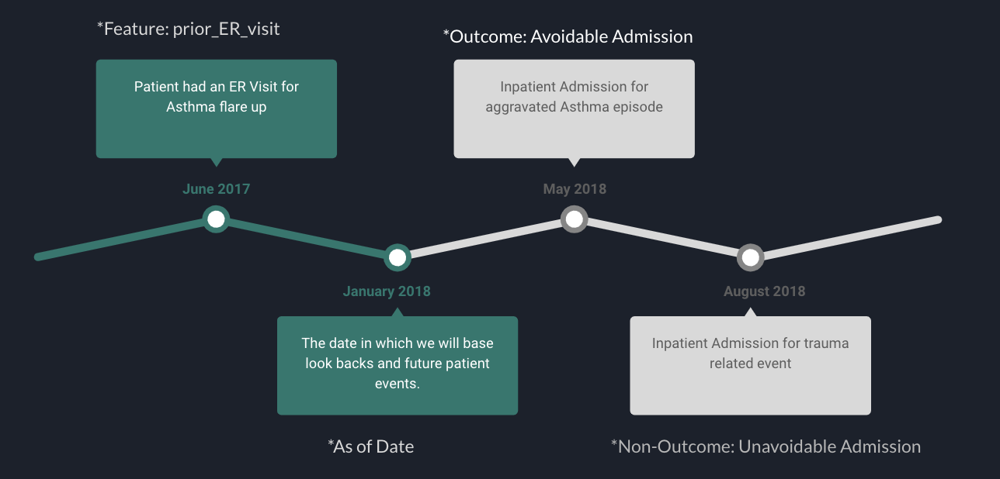

# Improving Hospital Inpatient Admissions Predictions Leveraging Temporal Relationships

Authors: Nick Tyler, Philip Johnson

## Summary 

### Background

In todays world their is a vast amount of data collected in the healthcare industry after the introduction of electronic health records and the introduction and use of service payment systems that health insurers use to pay providers of care. At every point of care - from a primary care doctor visit to an ER visit to each medication presecription fill at the pharmacy - a data point is collected and stored in d datawarehouse.  With the cost of data storage decreasing dramatically, we now have the ability to store all of this data for use in many different ways. 

Healthcare insurers and providers can leverage all of this data and predictive models to proactively identify patients that are likely going to need extra care so that they can praoctively reach out to these patients prior to getting sicker. The healthcare industry leverages these models to predict things like which patients are likely to end up needing the ER and which patients are likely going to progress in severity of the conditions that they have.

For our project, we were able to secure access to a Medicare based claims dataset to analyze and use to predict future hospital admissions. The dataset includes historical patient data that we can use to build features that look at prior history of patients to predict future outcomes. We sought out to leverage this data in differnet ways to try and improve predictive capabilities. Our first priority was to try and build features that would leverage this data in the best way to improve modeling. Because we had historical data, our first goal was to leverage the temporal nature of this data to build features that took into account recency of prior medical history in the hopes that features that account for this would improve models. By example, does a feature that describes that a patient had an ER visit in the last 6 months or a feature that descibes that the patient had an ER visit 2 months ago produce better results in modeling.

### Goals and Outcomes

 For this project we analyzed the health insurance dataset on patient outcomes to try to predict future hospital admissions. The goal of the project had two main objectives:
 
 1. Prove that temporal relationships in a medical patients history improves the ability to predict future hospital admissions
 2. Leverage the temporal feautures and multiple ML algorithms to get the best performing model we could.

### Summary of Results

Overall we found reasonable evidence that adding temporal features to a previously non-temporal data set can help improve modeling outcomes of admission predictions. We looked at several time frames for features within the training data, as well as several timeframes for the response variable of "admitted to hospital within x months". The timeframes we used were 12, 6, 3, and 1 months. We then compared this to the non-temporal version of the model dataset, containing only one of the flags for the feature variables, being the 12 month timeframe feature variables. We found that especially for the prediction of outcomes over a shorter timespan (1 or 3 months), there is strong evidence to suggest that adding in multiple features to create a dataset with temporal characteristics resulted in improved outcomes for the model over a range of measurements. We found model accuracy and AUC scores to be improved in models across all timeframes. We also found these improved differences to be statistically significant at the .05 level when predicting admission within 1 or 3 months. 

After leveraging the temporal feature dataset and a number of different types of ML aglorithms, we were able to achieve quite goood model resutls for predicting 6 month future admissions. We found that a Gradient Boosting algorithm achieved the best results for us, giving us a final AUC of .84 and an accuracy of .95. For this type of outcome modeling, we are really the most interested in how well we can predict for the highest risk patient in the population - so a few other metrics are actually a bit more intersting in assessing model performance.

- Rate 10 (average outcome rate of the top 10% of the population): 25%
- Coverage (percent of total admissions identified when looking at the top 10% of high risk patients): 45%
- Lift (average outcome rate of the top 10% of the population compared to the average outcome rate of the entire population): 5x

## Data Processing and Transformation

### Data Sources

We were able to secure health insurance data that provides information tracked by the insurance company to track payments for services rendered to patients, medication prescriptions, and other relevant information pertaining to patients and the insurance company. This data is all cleansed and staged with the purpose of building out predictive modeling to support population health initiatives and improving patient care.

Example data elements include the following:

Patient Demographic Data

This is data collected on members of the insurance company when you enroll with a plan

- age
- race
- gender
- language

Enrollment Data

Historical information of what members were enrolled on the plan when tracks the enrollment segments of members on specific plan with their specific benefit packages

- duration on plan type
- insurance type
- duration with primary care provider

Medical Events Data

- ER visits
- inpatient admissions
- admissions
- PCP visits

Medications Data

Historical prescription fills for each members

- NDC (medication type)
- dosage
- supply
- recent prescription fill count
- drug type
- patient diseases

Disease/Condition list for each member

Examples:

- Asthma Indicator
- Diabetes Indicator

### Data Transformation

In order to perform analysis and modeling on our dataset, our goal was to flatten all of the above data sources into a patient record. The reason behind this is so that we have a representation of the current and past state of each patient contained within one record. In order to do this, we created a record with features representing the different aspects of each patient we want to model on, and ran aggregation across the different data sources to fill in the features for each patient.

Demographic Data

This data was already in the form of one line per patient so no transformation was needed

Event Data

This data source was structured as a one line per visit dataset, meaning that a single patient may have multiple lines containing data relevant to our analysisn. This data was collapsed down into indicator features which were one hot encoded. This included features such as ER visits within the last 12, 6, 3, and 1 months. We performed similar tranformation on PCP visits and inpatient admissions.

Patient Medication Data

This data source was structured on a one line per medication per fill basis. This means that each patient would have a record for every time they fill a medication, for each medication that they are currently perscribed. This data was collapsed down into indicators features and into count features. The count features represented how many times a patient had filled any perscription within the past 6 and 12 months. The indicator features represent one hot features indicating the class of medication that a patient might have filled, such as "high risk", "opioid", and "potentially harmful".

Disease Data

This data source was structured on a per disease per patient basis. This data was collapsed down into a high number of one hot features indicating whether or not a patient had been diagnosed with a given disease. For the majority of patients this resulted in a sparse data set with only one or two features that were relevent to them. 

The chart below shows the prevelance of common chronic conditions within the population. Hypertension, diabetes and obesity are the most common conditions and these conditions tend to be high importance features in model development.

Model Data 

In order to create the dataset for modeling, we merged all of the different datasets into a single record for a patient, creating a unqiue record per patient with each column being a developed feature. This process allowed us to send the data into the feature imporatnce algorithnm as well as the ML algos across multiple outcome types. The diagram below shows how we leveraged the different data sources to create a single patient record:

## Approach and Methods

### Datasets for Analysis

For the analysis portion of the project, we reduced the data as described above into lists of observations of patient records. However, our intention is to analyze the effects of adding temporal features to the observations rather than using simple indicator variables. Because of this, we have created two datasets of these observations described above.

Non-Temporal

The non-temporal dataset contains all of the indicator variables for diseases, counts of medication, and medication indicators. For the event data described above, we have included only indicator variables for 12 month periods. This means that we are only tracking whether or not a certain event or visit occured for a patient at one time range rather than over a spectrum of time.

Temporal

The temporal dataset contains all of the same features as the non-temporal dataset, but also includes indicator variables for medical events over 6, 3, and 1 month periods. This means that medical events are encoded in 4 variables per event type rather than just 1 indicator variable.

Outcome Definition

For this project, our outcome variable for predictions is future a avoidable admissions. An 'avoidable' admission is defined as an admission that was not pre-planned or random. Pre-planned events are things like planned surgeries and pregnancies. Random events are things like trauma related events or accidents. It is very important in distinguishing between these event types as it does not make business sense to try and predict random events and it is not possibnle to predict planned surgeries given the nature of the event. 

The diagram below walks through an example patient timeline in which we can create fefatures from. We sbasically draw a line in time and call it the 'as of date' which becomes the point in which we base prior history on and future outcomes. In this example, our 'as of date' is January of 2018 - so historical features are constructed by looking at patient medical history prior to January 2018 and the outcome is based off of admissions that occured post January 2018. 

We see that this patient would be a positive instance in the training dataset because the patient had an 'avoidable' admission after the defined 'as of date':

### Feature Importance Analysis

As an initial look at the various time based features and their effects on any modeling that is done, we ran an initial feature importance test on the temporal features within the temporal dataset. We sorted the variables in descending order of importance with the most important features being first and the least important being last. The importance scores that we used to rank the features were pulled from a binary tree classification model. Scores were given for all features within the dataset, but we ranked only the temporal features, any only looked at features which ranked inside the top 6 temporal features. A table summarizing the results is below.

The above table shows that there is a case for the importance of the additional temporal features over only the 12 month features. With the exception of the 12 month admission response variable, at least one of the 12mo temporal features is not included within the top 6 for that response variable. This means that some of the other time periods for these models are more important predictors, which suggests that excluding them may produce worse results.

One additional observation from the above table is that the shorter term features seem to become more important as the time range of the response variable becomes shorter. The 3 and 1 month features are more important for predicting 3 and 1 month admission, based on the model used to generate this table. This suggests that the temporal nature of these features may be more beneficial as the prediction period shortens.

### Sampling Method and Data Exploration

For each dataset, we originally used the complete dataset of 500k rows to build our models. However, due to the unbalanced nature of our response variables, our models performed quite poorly. We received high accuracy rates but had too high of a false positive rate relative to our true negative rate, showing the model was simply just predicting the most frequent value for the response variables. 

The diagram below shows how unbalanced the dataset was - for 12 month admissions we see an outcome rate of about 10% and for 6 month outcomes we see about a 5% outcome rate.

Becuase of the high imbalance of the outcome variable, we downsampled the number of "negative" samples to get a more balanced subset of the data. We sampled 30k records with a positive 12 month readmission rate, and 30k with a negative, resulting in 60k samples for modeling. From these 60k samples, we used 80% for training data, and 20% for testing data.

Our final reduced observation count of observations we used to build our datasets was 515k records. Of these records, 37k were admitted to a hospital within 12 months of the "as-of" date. 21k were admitted within 6 months, 12k were admitted within 3 months, and 4.5k were admitted within one month. Summary graphs of the data are included below.

### Modeling Method:

#### Temporal Modeling

We ran two iterations of a model, one for the non-temporal dataset, and one for the temporal dataset. In these models, we made predictions against the range of response variables, readmission within 1, 3, 6, and 12 months. In both of the models, we used a logistic classification model.

#### Performance Modeling

After proving the temporal feature are important to improving modeling performance, we then attempted to create a single model that could best predict future 6 month admissions for patients leveraging the temporal features. We leveraged a number of different models to attempt to get the best results we possibly could:

1. Logistic Regression
2. Decision Tree
3. Neural Network
4. Gradient Boosting

## Results

### Temporal Modeling

The following model performance information pertains to the comparison of model performance when leveraging temporal features versus not using temporal features.

Below are the accuracy scores across the different outcome variable time periods. Here we can see a clear advantage for the temporal model overl the non-temporal model. The temporal model performs better that the non-temporal model over every response variable. As is the case in the ROC curves, the temporal model has the largest advantage over the non-temporal one during the 3 and 1 month admission predictions. also of note is the overall shape a score progression on the chart. Both models do relatively well during the 12 month prediction bucket, and worst in the 3 month prediction bucket. This is particularly interesting as this does not follow the trend of the accuracy scores below which increase steadily from 12 to 1 months. It is possible that due to the proportions of the 3 month dataset that the model is overfitting for one of the response variable groups.

Below are ROC plots, one for each of the four response variable timeframes. While the performance of the temporal and non-temporal models are similar for the 12 month admission prediction, the models begin to diverge as the estimation period becomes shorter. In the 1 month readmission model, there is a clear seperation between the ROC curve of the two models.

### Perforamance Modelding

#### ROC

The chart below shows the ROC curves acfoss all four algorithms used for predicting 6 months hospital admissions. The results are fairly consistent with Gradient Boosting and Logistic Regression slightly outperforming the other models. The key shows the AUC achieved for each model, with the best performing models achieving an AUC of .84 - which is actually a bit better than expected. 

#### Precision Recall

The Precision Recall curve below shows a similar curve for Logistic Regression and Gradient Boosting where Gradient Boosting slightly outperforms logistic regression. For Gradient Boosting and Logistic Regression, their does not appear to be much a bias towards precision or recall but a fairly linear relationship between the two. Their could be some future performacne tuning to be made where we would want to bias the models slightly towards recall as it is important to improve the total relevant results correctly classified by our algorithm

#### Rate 10, Converage, and Lift

For the following metrics, we bin the testing data in 10 equal sized bins ordering by the predicted probablity value of an admission creating a bin for each 10% of the population. We then focus on the top bin (top 10% at risk patients) to calaculate the metrics below. These are nice metrics for this type of problem given the biased nature of the outcome as well as th fact that healthcare providers only have the ability to target limited number of patients. 

Rate 10 describes the average number of admissions within the 10% of high risk patients: 25%

Coverage describes the percent of total admissions identified when looking at the top 10% of high risk patients: 45%

Lift gives us a way to compare how well we do at predicting high risk patients as compared to the rest of the population. In this example, we are comparing average outcome actual of the top 10% of high risk patients to the average outcome of the entire population to identify how much 'lift' we get when using our model versus identifying patients at random. The average outcome rate of the top 10% of patients (Rate 10) is 25% whereas the average outcome of the entire population is 5%. So targeting the top 10% of patients would yield a 1 in 5 chance of targeting a patient who will have a hosptial admisiosn versus on average 1 in 20 patients will have a hospital admission. In this case, we achieve a lift of 5x.

## Discussion

Through the work of this project, we have successfully shown that the use of temporal features can improve the modleing process and in the end provide more accurate predictions on which patients will be at risk of needing future hospital care. The information can be used to better inform feature development in the modeling process within the healthacre industry to help build better and more relevant features. It can be important to keep in mind ways of leveraging the temporal nature of the data into features that take into account recency of patient behavior. 

The next step of this type of work would be to also leverage severity as a way of improving feature enhancement. Just like the temporal nature of medical history information, their is also an inherent serverity nature of the data. We could leverage the data to identify how severe recent patient history is, not just a generic interpretation of what has happened. By example, we could use diagnosis information to give more insight into recent patient history, tagging events with a serverity value. An ER visit for severe asthma is likely a better predicting of future poor outcomes than an ER visit for the flu. We could leverage this information to give more context and relevance around the historical events that we create for a patient.

Overall, we are happy with the results achieved and glad we could succeed in achieving the goals we set out to accomplish. Our final performance modeling scores are actually farily comprable to performance you can find in published papers that attempt to solve similar problems. 

## Contributions

Both members of the group contributed equally to the project. Phil Johnson has acted as the point of contact between the group and the interested company, as well as contributed to the data modeling and transformation pieces. Nick Tyler has also contributed during the data transformation steps in addition to the modeling. Both members contributed equally to the report.

## Appendix

Github Repo: https://github.com/philip-johnson-2/DS5500

